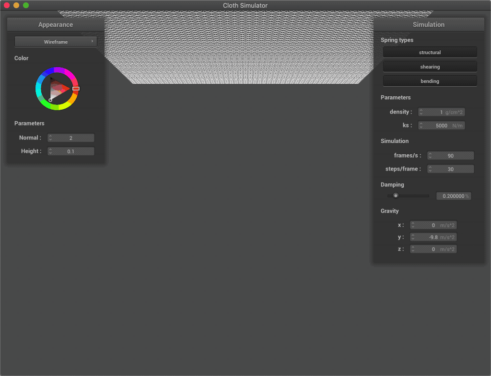

Assignment 4: Cloth Simulation
====================
Fanyu Meng

## Overview

## Part 1: Masses and springs

In this part, we created a cloth representation with a grid of point
masses and springs that connect them. We categorize the springs as
structural, shearing or bending by connect to different point masses.

    <table width="100%" align="middle">
        <tr>
            <td align="middle">
                
            </td>
            <td align="middle">
                
            </td>
            <td align="middle">
                
            </td>
        </tr>
        <tr>
            <td align="middle">
                <figcaption align="middle"> 
                    <code>pinned2.json</code> representation.
                </figcaption>
            </td>
            <td align="middle">
                <figcaption align="middle"> 
                    <code>pinned2.json</code> with only shearing constraints.
                </figcaption>
            </td>
            <td align="middle">
                <figcaption align="middle"> 
                    <code>pinned2.json</code> with only structual and bending constraints.
                </figcaption>
            </td>
        </tr>
    </table>

## Part 2: Simulation via numerical integration

In this part, we enabled cloth physics simulation by simulating the 
calculating the forces on all point masses and integrate the position 
change via Verlet integration. The forces is calculated by incorporating
global forces like gravity and the internal forces from the springs. 
Verlet integration is done by saving the location for each point masses
at the previous timestamp and use it to approximate velocity. We also 
made a constraint on the springs that they cannot extent more than 10% 
of their rest length to prevent overly extended springs.

In the following table, we can see the difference result from different 
configuration. The images in the middle column are identical and is for
reference.

    <table width="100%" align="middle">
        <tr>
            <td align="middle"> </td>
            <td align="middle"> Low </td>
            <td align="middle"> Default </td>
            <td align="middle"> High </td>
        </tr>
        <tr>
            <td align="middle"> density </td>
            <td align="middle">
                
            </td>
            <td align="middle">
                
            </td>
            <td align="middle">
                
            </td>
        </tr>
        <tr>
            <td align="middle"> ks </td>
            <td align="middle">
                
            </td>
            <td align="middle">
                
            </td>
            <td align="middle">
                
            </td>
        </tr>
        <tr>
            <td align="middle"> damping </td>
            <td align="middle">
                
            </td>
            <td align="middle">
                
            </td>
            <td align="middle">
                
            </td>
        </tr>
    </table>

As we can see:
- Density controls the effects of gravity. A lower density will cause 
the cloth to be be less dangling, and a higher density will cause the 
middle part of the cloth to be lower. However, an even higher density 
will have little effects on the result, since our constraint on the 
maximum length of the springs prevents them from over-extending;
- The coefficient of the springs controls how much is the internal 
forces inside the spring, and is like a counterpart to gravity. A low 
`ks` value will cause the cloth to swing more due to gravity, while a 
piece of cloth with a higher `ks` value will be more restricted in 
movement; 
- Damping controls how much the cloth wobbles. With a lower damping 
coefficient, the cloth would swing erratically, while under a higher 
damping value it will barely swing and move very slowly.

    
    <figcaption align="middle"> 
        <code>pinned4.json</code> in its terminal state.
    </figcaption>

## Part 3: Handling collisions with other objects

## Part 4: Handling self-collisions

## Part 5: Shaders
