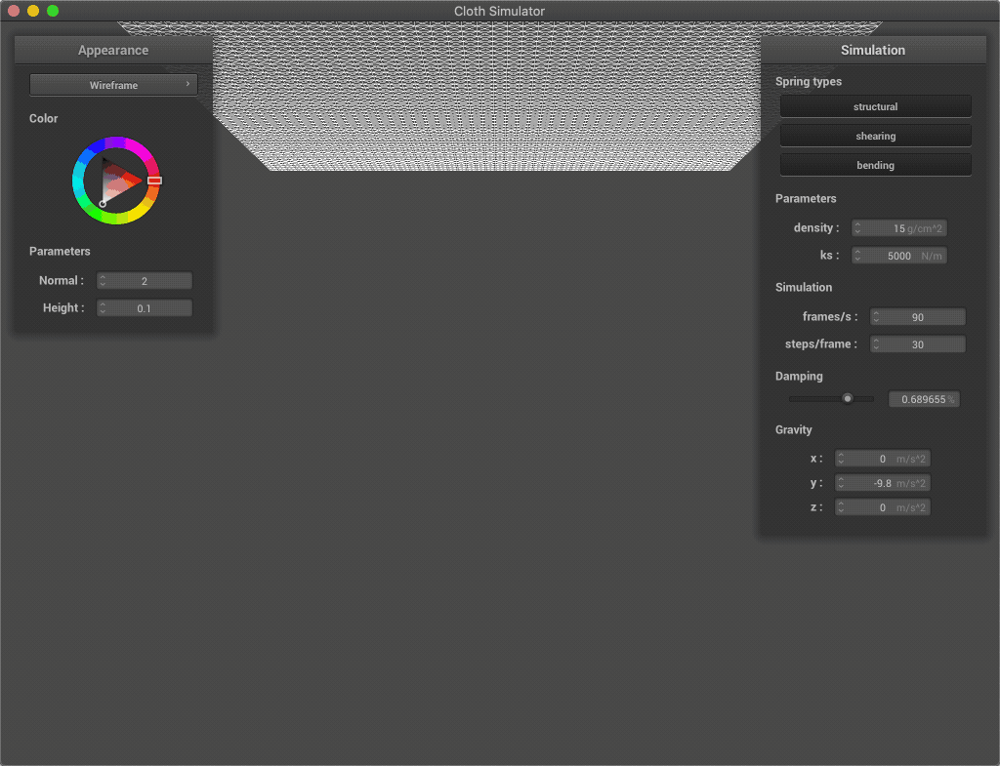

Assignment 4: Cloth Simulation
====================
Fanyu Meng

## Overview

## Part 1: Masses and springs

In this part, we created a cloth representation with a grid of point
masses and springs that connect them. We categorize the springs as
structural, shearing or bending by connect to different point masses.

We achieve this by splitting the plane of the cloth evenly into 
`num_width_points * num_height_points` point masses and store them into 
the array, and then try adding three types of springs accordingly if 
both points are valid coordinates.

    <table width="100%" align="middle">
        <tr>
            <td align="middle">
                
            </td>
            <td align="middle">
                
            </td>
            <td align="middle">
                
            </td>
        </tr>
        <tr>
            <td align="middle">
                <figcaption align="middle"> 
                    <code>pinned2.json</code> representation.
                </figcaption>
            </td>
            <td align="middle">
                <figcaption align="middle"> 
                    <code>pinned2.json</code> with only shearing constraints.
                </figcaption>
            </td>
            <td align="middle">
                <figcaption align="middle"> 
                    <code>pinned2.json</code> with only structual and bending constraints.
                </figcaption>
            </td>
        </tr>
    </table>

## Part 2: Simulation via numerical integration

In this part, we enabled cloth physics simulation by simulating the 
calculating the forces on all point masses and integrate the position 
change via Verlet integration. The forces is calculated by incorporating
global forces like gravity and the internal forces from the springs. 
Verlet integration is done by saving the location for each point masses
at the previous timestamp and use it to approximate velocity. We also 
made a constraint on the springs that they cannot extent more than 10% 
of their rest length to prevent overly extended springs.

We first compute the total force by adding up the global forces (e.g. 
gravity) and the internal forces using Hooke's Law on the springs. Then,
we compute displacement using Verlet integration by incorporating the 
previous location, the velocity and the acceleration. We also scale down 
the effect velocity to simulate frictions. After that, for all springs 
that are extending more than 10%, we move the corresponding point masses 
back to prevent the spring from over-extending.

In the following table, we can see the difference result from different 
configuration. The images in the middle column are identical and is for
reference.

    <table width="100%" align="middle">
        <tr>
            <td align="middle"> </td>
            <td align="middle"> Low </td>
            <td align="middle"> Default </td>
            <td align="middle"> High </td>
        </tr>
        <tr>
            <td align="middle"> density </td>
            <td align="middle">
                
            </td>
            <td align="middle">
                
            </td>
            <td align="middle">
                
            </td>
        </tr>
        <tr>
            <td align="middle"> ks </td>
            <td align="middle">
                
            </td>
            <td align="middle">
                
            </td>
            <td align="middle">
                
            </td>
        </tr>
        <tr>
            <td align="middle"> damping </td>
            <td align="middle">
                
            </td>
            <td align="middle">
                
            </td>
            <td align="middle">
                
            </td>
        </tr>
    </table>

As we can see:
- Density controls the effects of gravity. A lower density will cause 
the cloth to be be less dangling, and a higher density will cause the 
middle part of the cloth to be lower. However, an even higher density 
will have little effects on the result, since our constraint on the 
maximum length of the springs prevents them from over-extending;
- The coefficient of the springs controls how much is the internal 
forces inside the spring, and is like a counterpart to gravity. A low 
`ks` value will cause the cloth to swing more due to gravity, while a 
piece of cloth with a higher `ks` value will be more restricted in 
movement; 
- Damping controls how much the cloth wobbles. With a lower damping 
coefficient, the cloth would swing erratically, while under a higher 
damping value it will barely swing and move very slowly.

    
    <figcaption align="middle"> 
        <code>pinned4.json</code> in its terminal state.
    </figcaption>

## Part 3: Handling collisions with other objects

In this part, we make sure that the cloth can correctly collide with 
spheres and planes by move the point masses back a little bit if it is 
colliding with the object.

For spheres, we define a collision as the situation where the location 
of the point mass is inside the sphere. If collides, we move the mass 
towards the surface of sphere from its previous location, and scale down 
the displacement by a friction factor; 

For planes, we define a collision 
as the current location and the previous location of the mass is on 
different sides of the plane. If collides, similarly, we move the mass 
towards the other side of the plane from it previous location, and scale 
down the displacement by a friction factor. We also make sure that if 
its location is too close to the plane, we move the mass out a little 
bit to prevent the cloth from vibrating.

    <table width="100%" align="middle">
        <tr>
            <td align="middle">
                
            </td>
            <td align="middle">
                
            </td>
            <td align="middle">
                
            </td>
        </tr>
        <tr>
            <td> 
                <figcaption align="middle"> 
                    Cloth colliding with a sphere with ks=500.
                </figcaption> 
            </td>
            <td> 
                <figcaption align="middle"> 
                    Cloth colliding with a sphere with ks=5000.
                </figcaption> 
            </td>
            <td> 
                <figcaption align="middle"> 
                    Cloth colliding with a sphere with ks=50000.
                </figcaption> 
            </td>
        </tr>
    </table>

As we can see, the smaller the coefficient of the spring is, the more 
the cloth will dangle from the sphere. If ks is large, the internal 
force from the springs will hold the cloth from dangling more.

    
    <figcaption align="middle"> 
        Cloth resting on a plane with diffuse lighting.
    </figcaption>

## Part 4: Handling self-collisions

In this part, we resolve the issue of the cloth's self-collision with a 
somewhat efficient algorithm with hashing.

    
    <figcaption align="middle"> 
        Folding cloth in a somewhat restful state.
    </figcaption>

At each timestamp, we map calculate the hash for the positions of all 
point masses and generate a hash table. The hash is calculated by taking 
modulo of its position by a empirical hash box size, and then sum the 
coordinates with different power of a prime number, like generating a 
hash for a polynomial or a string. Then, for each hash box, we apply a 
correction displacement for each different point in the same box, trying 
to move so that the masses are at least `2 * thickness` away from each 
other. The final displacement is the weighted sum of the corrections 
from all other masses in the same box. In this way, our cloth is moving 
itself from collapsing on itself.

Again, in the following table, we can see the difference result from 
different coefficients. The images in the middle column are identical 
and is for reference.

    <table width="100%" align="middle">
        <tr>
            <td align="middle"> </td>
            <td align="middle"> Low </td>
            <td align="middle"> Default </td>
            <td align="middle"> High </td>
        </tr>
        <tr>
            <td align="middle"> density </td>
            <td align="middle">
                
            </td>
            <td align="middle">
                
            </td>
            <td align="middle">
                
            </td>
        </tr>
        <tr>
            <td align="middle"> ks </td>
            <td align="middle">
                
            </td>
            <td align="middle">
                
            </td>
            <td align="middle">
                
            </td>
        </tr>
    </table>

As we can see, ks and density are acting like a pair of antagonist 
forces. A higher ks or a lower density will cause less number of folds 
to appear since the cloth will tend to preserve its original shape, 
while a lower ks or a higher density will cause it to fold faster and in
more number of folds.

## Part 5: Shaders
